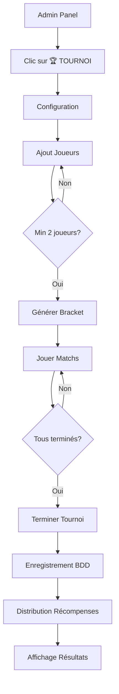

# 🎮 Système de Tournois - ToilesCoins

## 🎯 Objectif

Créer une interface complète de gestion de tournois inspirée de **Toornament.com**, permettant aux administrateurs de :
- Créer des tournois personnalisés
- Ajouter des joueurs (inscrits ou non)
- Générer automatiquement un arbre de compétition
- Gérer les matchs et scores en temps réel
- Attribuer automatiquement badges et monnaie aux vainqueurs

## 🚀 Accès rapide

### Pour les administrateurs :
1. Aller sur `/admin`
2. Onglet **ÉVÉNEMENTS** → **TYPES**
3. Cliquer sur **🏆 TOURNOI** pour n'importe quel type d'événement

### URL directe :
```
/tournaments?typeId=<ID_TYPE>&typeName=<NOM_TYPE>
```

## 📋 Fonctionnalités principales

### 1. Configuration du tournoi
- Nom personnalisé
- Date et heure
- Type d'événement automatique

### 2. Gestion des joueurs
- **Joueurs inscrits** : Recherche par pseudo, récompenses automatiques
- **Joueurs invités** : Ajout manuel, participation sans récompenses
- Minimum 2 joueurs requis

### 3. Génération de bracket
- **Arbre à élimination directe**
- Taille automatique (puissance de 2)
- Distribution aléatoire des joueurs
- Byes automatiques si nécessaire

### 4. Gestion des matchs
- Saisie des scores en temps réel
- Validation match par match
- Progression automatique des vainqueurs
- Rounds organisés (Quarts, Demi, Finale)

### 5. Résultats et récompenses
| Position | Monnaie | Victoires | Badge |
|----------|---------|-----------|-------|
| 🥇 1er   | +500 TC | +1        | ✅    |
| 🥈 2ème  | +300 TC | 0         | ✅    |
| 🥉 3ème  | +150 TC | 0         | ✅    |

## 🎨 Interface

L'interface est divisée en 4 onglets :

### 📋 CONFIGURATION
- Paramètres du tournoi
- Nom et date

### 👥 JOUEURS
- Ajout de participants
- Liste des inscrits
- Bouton "Générer l'arbre"

### 🏆 ARBRE
- Visualisation du bracket
- Saisie des scores
- Validation des matchs
- Bouton "Terminer le tournoi"

### 🏅 RÉSULTATS
- Podium final
- Statistiques
- Récompenses distribuées

## 💾 Base de données

### Collections Firestore

#### `tournaments`
Stocke tous les tournois créés avec :
- Informations générales
- Liste des joueurs
- Tous les matchs
- Résultats finaux

#### `events`
Créé automatiquement à la fin du tournoi pour l'historique

#### `transactions`
Une transaction par joueur récompensé

#### `users`
Mise à jour automatique :
- `balance` : +points
- `wins` : +1 (champion uniquement)
- `eventsCount` : +1

## 🔧 Technologies utilisées

- **Next.js 16** avec App Router
- **TypeScript** pour la sécurité des types
- **Firebase Firestore** pour la base de données
- **Lucide React** pour les icônes
- **Neo-brutalist design** pour l'esthétique

## 📊 Exemples d'utilisation

### Tournoi Mario Kart (8 joueurs)
```
1. Créer "Mario Kart Championship 2025"
2. Ajouter 8 joueurs
3. Générer → 7 matchs (4+2+1)
4. Jouer les matchs
5. Terminer → Récompenses distribuées
```

### Tournoi FIFA (16 joueurs)
```
1. Créer "FIFA World Cup"
2. Ajouter 16 joueurs
3. Générer → 15 matchs (8+4+2+1)
4. Gérer les rounds
5. Finaliser
```

## 🎯 Workflow complet



## 🔐 Sécurité

- ✅ Accès réservé aux administrateurs
- ✅ Validation des données côté serveur
- ✅ Récompenses distribuées une seule fois
- ✅ Transactions enregistrées pour audit
- ✅ Impossible de modifier après finalisation

## 🎨 Design

Le design suit la charte graphique de ToilesCoins :
- **Couleur principale** : Jaune (#FFC845)
- **Style** : Neo-brutalist (bordures épaisses, ombres fortes)
- **Typographie** : Uppercase, bold, impactante
- **Composants** : Cartes avec bordures noires épaisses

## 📱 Responsive

L'interface s'adapte à tous les écrans :
- **Desktop** : Grille 3 colonnes pour les matchs
- **Tablet** : Grille 2 colonnes
- **Mobile** : Colonne unique

## 🚧 Améliorations futures

- [ ] Sauvegarde en temps réel dans Firestore
- [ ] Historique des tournois passés
- [ ] Statistiques par joueur
- [ ] Double élimination
- [ ] Round-robin
- [ ] Streaming en direct
- [ ] Notifications push
- [ ] Export PDF
- [ ] Système ELO

## 📚 Documentation

- **Guide complet** : `TOURNAMENT_SYSTEM.md`
- **Code source** : `app/tournaments/page.tsx`
- **Modification admin** : `app/admin/page.tsx` (ligne 1854)

## 🎉 Résultat

Un système complet de gestion de tournois, professionnel et facile à utiliser, qui :
- ✅ Simplifie l'organisation d'événements compétitifs
- ✅ Automatise la distribution des récompenses
- ✅ Offre une expérience utilisateur premium
- ✅ S'intègre parfaitement à l'écosystème ToilesCoins

---

**Créé le** : 2025-12-05  
**Version** : 1.0  
**Auteur** : Antigravity AI  
**Statut** : ✅ Opérationnel
